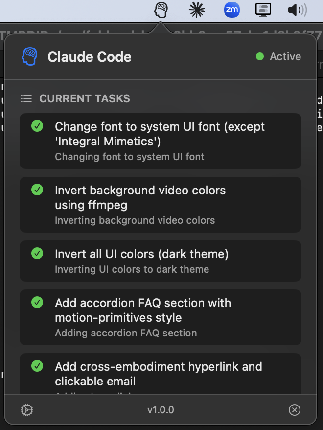

# ClaudeMenuBar

Native macOS menu bar app for Claude Code CLI. Shows current tasks, handles approve/deny notifications, and provides Touch Bar controls.

<p align="center">
  
</p>

## Features

- **Menu Bar Status** — Claude icon appears when Claude Code is active in Terminal or Ghostty
- **NSPopover UI** — Native macOS dropdown showing current tasks and pending actions
- **Actionable Notifications** — Approve/deny permission requests directly from notifications
- **Touch Bar Support** — Quick approve/deny buttons on MacBook Pro Touch Bar
- **Task Completion Alerts** — Optional popover when tasks finish

## Install

```bash
git clone https://github.com/danielesiegel/claude-menubar.git
cd claude-menubar
chmod +x install.sh
./install.sh
```

## Build Manually

Requires Xcode 15+ and macOS 12+.

```bash
cd ClaudeMenuBar
swift build -c release
```

Or open in Xcode:
```bash
open ClaudeMenuBar/Package.swift
```

## How It Works

Uses Claude Code's hook system to receive events:

- `PreToolUse` — Triggers approval notifications for Bash, Write, Edit
- `Stop` — Task completion notifications
- `Notification` — Task updates

The installer configures `~/.claude/settings.json` automatically.

## Settings

Toggle in the popover menu:

| Setting | Description |
|---------|-------------|
| Permission Notifications | Show alerts for approve/deny |
| Task Complete Popover | Show popover when task finishes |
| Touch Bar Controls | Show approve/deny on Touch Bar |

## Uninstall

```bash
./uninstall.sh
```

## Requirements

- macOS 12+
- Claude Code CLI
- Terminal.app or Ghostty

## License

MIT
